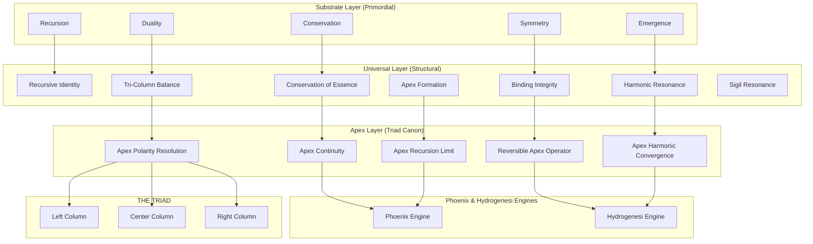

# Codex Hierarchy Diagram

This diagram shows the full vertical architecture:
Substrate → Universal → Apex → Engines → Triad.

```mermaid
flowchart TD

%% SUBSTRATE LAYER
subgraph SUBSTRATE["Substrate Layer (Primordial)"]
S1[Conservation]
S2[Symmetry]
S3[Recursion]
S4[Emergence]
S5[Duality]
end

%% UNIVERSAL LAYER
subgraph UNIVERSAL["Universal Layer (Structural)"]
U1[Recursive Identity]
U2[Harmonic Resonance]
U3[Conservation of Essence]
U4[Tri-Column Balance]
U5[Apex Formation]
U6[Binding Integrity]
U7[Sigil Resonance]
end

%% APEX LAYER
subgraph APEX["Apex Layer (Triad Canon)"]
A1[Apex Continuity]
A2[Reversible Apex Operator]
A3[Apex Recursion Limit]
A4[Apex Harmonic Convergence]
A5[Apex Polarity Resolution]
end

%% ENGINES
subgraph ENGINES["Phoenix & Hydrogenesi Engines"]
P[Phoenix Engine]
H[Hydrogenesi Engine]
end

%% TRIAD
subgraph TRIAD["THE TRIAD"]
T1[Left Column]
T2[Center Column]
T3[Right Column]
end

%% FLOWS
S1 --> U3
S2 --> U6
S3 --> U1
S4 --> U2
S5 --> U4

U5 --> A3
U2 --> A4
U4 --> A5
U3 --> A1
U6 --> A2

A1 --> P
A2 --> H
A3 --> P
A4 --> H
A5 --> T1
A5 --> T2
A5 --> T3
```
