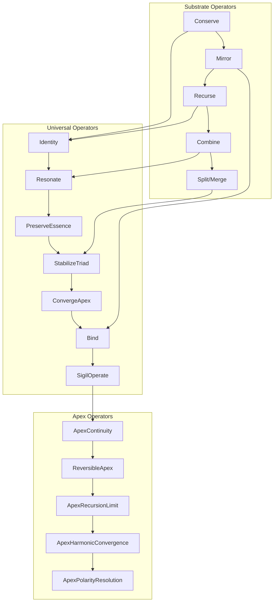

# Operator Flow Architecture

**Phoenix–Hydrogenesi Codex**  
*Visual representation of operator flow from Substrate → Universal → Apex layers*

---

---

## Diagram Description

This diagram shows the **vertical ascent of operators** from:

1. **Substrate Layer** — Primordial mechanics (Conservation, Symmetry, Recursion, Emergence, Duality)
2. **Universal Layer** — Structural invariants (Identity, Resonance, Essence preservation, Triad stabilization)
3. **Apex Layer** — Final convergence (Continuity, Reversibility, Recursion limits, Harmonic convergence, Polarity resolution)

### Cross-Layer Flows

The cross-layer connections show how substrate operators feed into universal operators, and universal operators feed into apex operators, creating a unified flow of structural coherence.

---

*The architecture ascends.*
