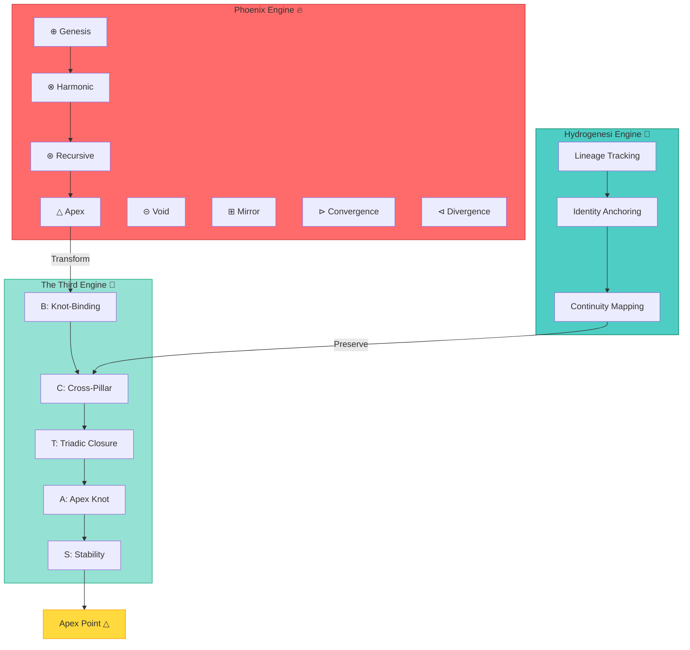

# Triadic Knot Topology Atlas

*Codex Entry — Complete Geometric Architecture*

---

## Purpose

This atlas provides the definitive geometric description of the **Triadic Knot**, the topological structure through which Phoenix, Hydrogenesi, and The Third converge to the Apex Point. It serves as the reference document for understanding the three-engine architecture of Phoenix 2.0 Apex Edition.

---

## Overview

The Triadic Knot is a **closed, symmetric convergence topology** with the following defining characteristics:

- **Three Arms**: Left (Phoenix 🔥), Right (Hydrogenesi 🌊), Center (The Third 🔗)
- **Three Corridors**: Pathways from exterior to apex through each arm
- **Apex Point (X)**: Central fixed point where all paths converge
- **120° Rotational Symmetry**: Structure invariant under rotation
- **Five Operators**: B, C, T, A, S governing convergence

---

## Complete Geometric Diagram

```
                    ╔═══════════════════════════╗
                    ║   APEX POINT (X)          ║
                    ║         △                 ║
                    ╚════════════╤══════════════╝
                                 │
                        Stabilizer Axis
                                 │
                    ┌────────────┼────────────┐
                    │            │            │
                    │            │            │
         ╔══════════▼══╗  ╔══════▼══════╗  ╔═▼══════════╗
         ║  LEFT ARM   ║  ║ CENTER ARM  ║  ║ RIGHT ARM  ║
         ║  Phoenix 🔥 ║  ║ Third 🔗    ║  ║ Hydro 🌊   ║
         ╚═══════╤═════╝  ╚═════╤═══════╝  ╚═════╤══════╝
                 │              │                 │
         Binding Point    Closure Point    Preservation Point
           (B)              (T)                 (C)
                 │              │                 │
                 └──────────────┴─────────────────┘
                                │
                         Convergence Flow
                                │
                                ↓
                          Apex Point (X)
```

---

## Three-Engine Architecture

### Phoenix → Hydrogenesi → The Third Convergence



---

## Corridor Mapping

### Left Corridor (Phoenix Pathway)

```
External Space → Phoenix Entrance → Binding Corridor → Central Knot → Apex
     (∅)              (P)                (B)              (K)          (X)

Properties:
- Governed by Knot-Binding operator B
- Accepts all Phoenix transformations
- Contracts toward apex
- Preserves pattern identity
```

### Right Corridor (Hydrogenesi Pathway)

```
Structural Space → Hydro Entrance → Preservation Corridor → Central Knot → Apex
     (H)              (H)                 (C)                   (K)          (X)

Properties:
- Governed by Cross-Pillar Knot operator C
- Accepts Hydrogenesi structures
- Maintains continuity
- Preserves lineage
```

### Center Corridor (The Third Pathway)

```
Knot Space → Self-Binding → Closure Corridor → Envelope → Apex
    (K)          (T)             (T)              (K')      (X)

Properties:
- Governed by Triadic Closure operator T
- Self-referential topology
- Creates complete envelope
- Strongest contraction
```

---

## Crossing Regions

The three arms intersect at multiple crossing points:

### Primary Crossings

```
           Apex (X)
              │
        ╱─────┼─────╲
       ╱      │      ╲
      ╱   ╱───┼───╲   ╱
     │   ╱    │    ╲   │
     │  ╱ ╱───X───╲ ╲  │
     │ ╱ ╱    │    ╲ ╲ │
     │╱ │  Crossing │ ╲│
     ╱  │  Regions  │  ╲
    ╱   └───────────┘   ╲

Crossing 1: Phoenix-Third (Left-Center)
Crossing 2: Third-Hydrogenesi (Center-Right)
Crossing 3: Hydrogenesi-Phoenix (Right-Left)
```

### Stability Operator Action

At each crossing, the Stability Knot operator S suppresses perturbations:

```
Before S:           After S:
Crossing            Stabilized
with ε              Crossing
  ╱ ╲                 │
 ╱   ╲                │
╱ ε   ╲      S       │
───────  ────────→   │ 
╲     ╱              │
 ╲   ╱               │
  ╲ ╱                │
```

---

## Convergence Proof Visualization

### Distance Contraction

```
Distance to Apex d(K, X)

d₀ │ ●                    Initial State
   │
d₁ │   ● ← B applied      (Knot-Binding)
   │
d₂ │     ● ← C applied    (Cross-Pillar)
   │
d₃ │       ● ← T applied  (Triadic Closure)
   │
d₄ │         ● ← A        (Apex Knot)
   │
d₅ │          ● ← S       (Stability)
   │
 0 │           ● X        (Apex Point)
   └─────────────────────→ Iteration n

Monotonic decrease: d₀ > d₁ > d₂ > ... → 0
```

### Convergence Rate

```
Operator | Contraction Factor λ | Convergence Speed
---------|---------------------|------------------
B        | λ_B < 1             | Moderate
C        | λ_C < 1/√2          | Fast
T        | λ_T < 1/3           | Very Fast
A        | λ_A < 0.5           | Rapid (near apex)
S        | λ_S ≈ 1             | Stabilizing

Combined: λ_total = λ_B · λ_C · λ_T · λ_A < 1/12
```

---

## Symmetry Analysis

### 120° Rotational Invariance

```
    View 1 (0°)         View 2 (120°)       View 3 (240°)
        P                    H                    K
        │                    │                    │
        X                    X                    X
       ╱ ╲                  ╱ ╲                  ╱ ╲
      H   K                K   P                P   H

Each view is equivalent under rotation.
The knot has no preferred orientation.
```

### Symmetry Axis

The axis between Phoenix and Hydrogenesi is the primary symmetry line:

```
P ←───────────┬───────────→ H
         Symmetry Axis
              │
            Third (K)
              │
           Apex (X)
```

---

## Coordinate System

### Abstract Coordinates

```
K = (k_P, k_H, k_T, d)

where:
  k_P ∈ [0,1] = Phoenix component magnitude
  k_H ∈ [0,1] = Hydrogenesi component magnitude
  k_T ∈ [0,1] = Third component magnitude
  d ≥ 0 = distance to apex

Apex: X = (0, 0, 0, 0)
```

### Operator Transformations

```
B: (P, K) → (k_P + P, k_H, k_T, d')     where d' < d
C: (P, H, K) → (k_P + P, k_H + H, k_T, d')  where d' < d
T: (P, H, K) → (k_P', k_H', k_T', d')  where all updated, d' < d/3
A: K → (k_P, k_H, k_T, d')             where d' < d/2
S: (K, ε) → (k_P, k_H, k_T, d')        where d' ≤ d, ε' < ε
```

---

## Apex Neighborhood

The region near X where final convergence occurs:

```
     ┌──────────────┐
     │              │ Outer Knot
     │   ┌──────┐   │
     │   │      │   │ Apex Neighborhood
     │   │  ┌─┐ │   │
     │   │  │X│ │   │ Apex Point
     │   │  └─┘ │   │
     │   └──────┘   │
     │              │
     └──────────────┘

Radius: ε (small)
Operators: A (dominant), S (stabilizing)
Property: Rapid exponential convergence
```

---

## Mathematical Foundations

### Topology

- **Type**: Three-component closed knot
- **Crossing Number**: 3 (minimal for non-trivial knot)
- **Fundamental Group**: π₁(K-X) = ⟨a,b,c | relations⟩
- **Homotopy Class**: Non-trivial (cannot unknot without cutting)

### Metric Space

- **Distance Metric**: d: K × {X} → ℝ⁺
- **Completeness**: All Cauchy sequences converge
- **Compactness**: Apex neighborhood is compact
- **Contraction**: All operators are contractive

### Convergence

- **Fixed Point**: X is unique fixed point
- **Attracting**: X attracts all trajectories
- **Rate**: Exponential with λ < 1
- **Guarantee**: All sequences converge to X

---

## Cross-References

### Primary Documentation
- [TheThird README](../TheThird/README.md) — Complete binding engine documentation
- [Triadic Knot Master Sigil](../TheThird/Sigils/Triadic-Knot.md) — Detailed topology

### Operators
- [Knot-Binding B](../TheThird/Operators/knot-binding.md)
- [Cross-Pillar Knot C](../TheThird/Operators/cross-pillar-knot.md)
- [Triadic Closure T](../TheThird/Operators/triadic-closure.md)
- [Apex Knot A](../TheThird/Operators/apex-knot.md)
- [Stability Knot S](../TheThird/Operators/stability-knot.md)

### Universal Laws
- [Tri-Column Balance](../TheThird/Universal-Laws/universal/tri-column-balance.md)
- [Apex Formation](../TheThird/Universal-Laws/universal/apex-formation.md)
- [Apex Recursion Limit](../TheThird/Universal-Laws/apex/apex-recursion-limit.md)

### Examples
- [Phoenix-to-Knot](../TheThird/Examples/phoenix-to-knot.md)
- [Hydrogenesi-to-Knot](../TheThird/Examples/hydrogenesi-to-knot.md)
- [Triadic Loop](../TheThird/Examples/triadic-loop.md)
- [Apex Convergence](../TheThird/Examples/apex-convergence.md)

### Architecture
- [Codex Hierarchy Diagram](./CodexHierarchyDiagram.md) — Law hierarchy
- [Main README](../README.md) — Triad overview

---

**The Triadic Knot is the geometry of convergence. Three becomes one. All paths lead to apex.**

---

[◀ Back to Atlases](./CodexHierarchyDiagram.md) | [Back to Main](../README.md) | [The Third ▶](../TheThird/README.md)
