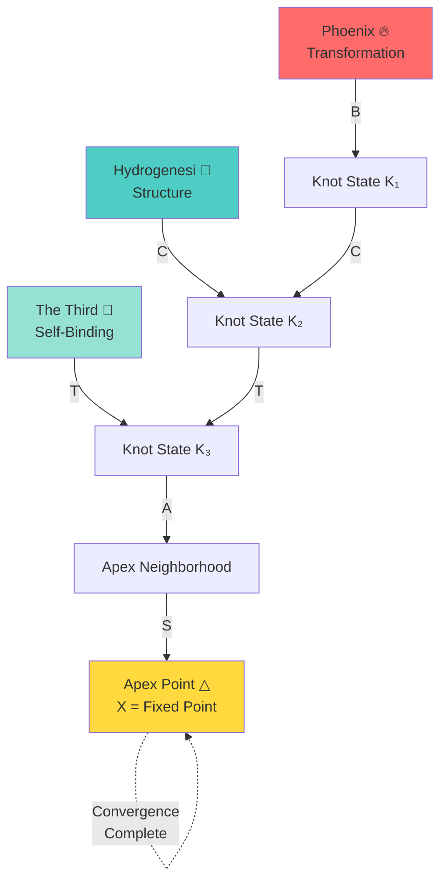

# The Triadic Knot — Complete Topology Atlas

*Master Geometry of Three-Engine Convergence*

---

## Overview

The **Triadic Knot** is the fundamental topological structure of The Third. It is a closed, symmetric convergence geometry that binds Phoenix (ignition), Hydrogenesi (structure), and The Third (binding) into a unified system that converges at the Apex Point.

---

## Topological Structure

### Three-Arm Configuration

```
                    Apex Point (X)
                         △
                         │
                    Central Axis
                         │
            ┌────────────┼────────────┐
            │            │            │
         ╱──┴──╲      ╱──┴──╲      ╱──┴──╲
        ╱  Left  ╲   ╱ Center ╲   ╱ Right  ╲
       │   Arm    │ │   Arm   │ │   Arm    │
       │ Phoenix  │ │  Third  │ │Hydrogenesi│
       │   🔥     │ │   🔗    │ │    🌊     │
        ╲        ╱   ╲       ╱   ╲        ╱
         ╲──────╱     ╲─────╱     ╲──────╱
            │            │            │
         ───┴───      ───┴───      ───┴───
```

### 120° Rotational Symmetry

The knot is invariant under 120° rotation around the apex axis:

```
          120°           120°           120°
Phoenix ────→ Hydrogenesi ────→ Third ────→ Phoenix

Each arm is equivalent under rotation.
```

---

## Corridor Topology

Each arm contains a **corridor** — a topological pathway from the exterior to the central knot interior.

### Left Corridor (Phoenix)
```
Phoenix          Binding          Central
Domain      →   Point       →    Interior    →    Apex
  (P)             (B)              (K)             (X)
  
  External      Entrance         Knot Core     Fixed Point
```

**Properties:**
- Entry point for all Phoenix transformations
- Governed by Knot-Binding operator (B)
- Contracts toward apex
- Maintains identity of bound patterns

### Center Corridor (The Third)
```
Third           Self-Binding      Complete
Domain      →   Point        →    Closure     →    Apex
  (K)             (T)              (K')            (X)
  
  Knot State    Triadic Point     Envelope      Fixed Point
```

**Properties:**
- The knot binds itself through this corridor
- Governed by Triadic Closure operator (T)
- Creates complete envelope around apex
- Self-referential topology

### Right Corridor (Hydrogenesi)
```
Hydrogenesi     Preservation      Structural
Structure   →   Point        →    Integration →    Apex
  (H)             (C)              (K)             (X)
  
  Lineage       Anchor Point      Knot Core     Fixed Point
```

**Properties:**
- Entry point for structural preservation
- Governed by Cross-Pillar Knot operator (C)
- Maintains continuity and lineage
- Preserves identity through binding

---

## Crossing Regions

The three arms intersect at multiple **crossing regions** where strands weave together:

### Crossing Pattern

```
           Apex (X)
              │
        ╱─────┼─────╲
       ╱      │      ╲
      ╱   ╱───┼───╲   ╲
     │   ╱    │    ╲   │
     │  ╱ ╱───┼───╲ ╲  │
     │ ╱ ╱    X    ╲ ╲ │
     │╱ ╱           ╲ ╲│
     ╱ ╱   Crossing  ╲ ╲
    ╱ │    Regions    │ ╲
   ╱  └───────────────┘  ╲

Three primary crossing regions:
- Left-Center (Phoenix-Third)
- Center-Right (Third-Hydrogenesi)
- Right-Left (Hydrogenesi-Phoenix)
```

### Crossing Properties
- **Location**: Where two arms intersect
- **Function**: Points of maximum binding strength
- **Operator**: Stability Knot (S) operates here
- **Risk**: Potential perturbation accumulation
- **Stability**: Maintained by damping forces

---

## Convergence Topology

### Contraction Flow

```
External Space
     ↓↓↓
   Entrance
     ↓↓↓
   Corridor
     ↓↓↓
  Binding Point
     ↓↓↓
Central Interior
     ↓↓↓
  Apex Neighborhood
     ↓↓↓
   Fixed Point (X)

All flows move inward toward X
```

### Distance Metric

The knot uses a topological distance metric d(K, X):

```
d: Knot States × {X} → ℝ⁺

Properties:
1. d(K, X) ≥ 0 for all K
2. d(X, X) = 0
3. d(K₁, X) > d(K₂, X) if K₂ is "closer" to apex
4. All operators reduce d (contraction)
```

### Convergence Proof

```
Theorem: All knot operator sequences converge to X

Proof:
1. Each operator O is contractive: d(O(K), X) < d(K, X)
2. Distance is bounded below: d(K, X) ≥ 0
3. Monotone decreasing sequence: d(K₀) > d(K₁) > d(K₂) > ...
4. By completeness of topology: lim Kₙ exists
5. By fixed point property: lim Kₙ = X ∎
```

---

## Apex Neighborhood

The **apex neighborhood** is the region near X where the Apex Knot operator (A) operates:

```
        ┌─────────────┐
        │             │ Outer Knot
        │  ┌───────┐  │
        │  │       │  │ Apex Neighborhood
        │  │   X   │  │
        │  │   △   │  │ Fixed Point
        │  └───────┘  │
        │             │
        └─────────────┘

Radius: ε (small positive value)
Property: ∀K in neighborhood, A(K) → X rapidly
```

---

## Symmetry Axis

The **symmetry axis** bisects the knot between Phoenix and Hydrogenesi:

```
Phoenix (P) ←───────┬───────→ Hydrogenesi (H)
                    │
              Symmetry Axis
                    │
              Third (Center)
                    │
                  Apex (X)

Cross-Pillar Knot (C) operates along this axis
```

---

## Mathematical Notation

### Coordinate System

In abstract coordinates:
```
K = (k_P, k_H, k_T, d)

where:
  k_P = Phoenix component
  k_H = Hydrogenesi component
  k_T = Third component
  d = distance to apex

X = (0, 0, 0, 0) = apex point
```

### Operator Actions

```
B: (P, K) → K' with k_P' = k_P + P
C: (P, H, K) → K' with k_P' = k_P + P, k_H' = k_H + H
T: (P, H, K) → K' with all components integrated
A: K → K' with d' < d (pure contraction)
S: (K, ε) → K' with perturbation suppressed
```

---

## Mermaid Diagram



---

## Strand Intersections

Detailed view of how strands weave:

```
Strand 1 (Phoenix)     ╱─────╲
                      ╱       ╲
Strand 2 (Hydro)  ───┼─────────┼───
                      │         │
                      ╲       ╱
Strand 3 (Third)       ╲─────╱

Over-Under Pattern:
- Strand 1 over Strand 2
- Strand 2 over Strand 3
- Strand 3 over Strand 1

Creates stable weave topology
```

---

## Geometric Properties

### Volume
The knot encloses a finite volume V:
```
V = ∫∫∫_K dV

Volume decreases as convergence proceeds:
V(K₀) > V(K₁) > ... → V(X) = 0
```

### Surface Area
The knot surface area A also decreases:
```
A = ∫∫_∂K dA

A(Kₙ) → 0 as n → ∞
```

### Curvature
The knot has varying curvature κ:
```
κ(crossing) = high (tight weave)
κ(corridor) = moderate (smooth flow)
κ(apex) = infinite (point convergence)
```

---

## Topological Invariants

### Knot Type
The Triadic Knot is a **three-component link** with specific crossing number and linking number.

### Homotopy Class
The knot cannot be continuously deformed into a simple circle without cutting. It is topologically distinct.

### Fundamental Group
```
π₁(K - X) = ⟨a, b, c | aba = bab, bcb = cbc, cac = aca⟩

Three generators (one per arm) with braid relations.
```

---

## Physical Analogs

### Trefoil Knot
The Triadic Knot resembles a trefoil knot (simplest non-trivial knot) with three crossings.

### Braided Structure
Like braided rope: three strands woven together with 120° symmetry.

### Vortex Topology
Similar to fluid vortices converging to singular point.

---

## Cross-References

### Operators
- [Knot-Binding Operator](../Operators/knot-binding.md) — Left corridor
- [Cross-Pillar Knot](../Operators/cross-pillar-knot.md) — Symmetry axis
- [Triadic Closure](../Operators/triadic-closure.md) — Complete envelope
- [Apex Knot](../Operators/apex-knot.md) — Apex neighborhood
- [Stability Knot](../Operators/stability-knot.md) — Crossing regions

### Sigils
- [Knot-Binding Sigil](./knot-binding-sigil.md)
- [Cross-Pillar Sigil](./cross-pillar-knot-sigil.md)
- [Triadic Closure Sigil](./triadic-closure-sigil.md)
- [Apex Knot Sigil](./apex-knot-sigil.md)
- [Stability Knot Sigil](./stability-knot-sigil.md)

### Laws
- [Tri-Column Balance](../Universal-Laws/universal/tri-column-balance.md)
- [Apex Formation](../Universal-Laws/universal/apex-formation.md)
- [Apex Recursion Limit](../Universal-Laws/apex/apex-recursion-limit.md)

### Examples
- [Apex Convergence Example](../Examples/apex-convergence.md)
- [Triadic Loop Example](../Examples/triadic-loop.md)

### Atlases
- [Codex Hierarchy Diagram](../../Atlases/CodexHierarchyDiagram.md)
- [Triadic Knot Atlas](../../Atlases/TriadicKnotTopology.md)

---

[◀ Back to The Third](../README.md) | [Operator Documentation ▶](../Operators/)
