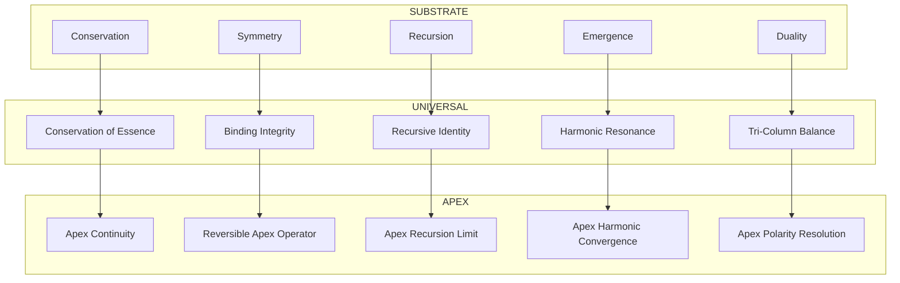

# Three‑Tier Law Architecture

## Mermaid Diagram

```mermaid
flowchart TD

%% SUBSTRATE LAYER
A1[Conservation] --> B1[Conservation of Essence]
A2[Symmetry] --> B2[Binding Integrity]
A3[Recursion] --> B3[Recursive Identity]
A4[Emergence] --> B4[Harmonic Resonance]
A5[Duality] --> B5[Tri-Column Balance]

%% UNIVERSAL LAYER
B1 --> C1[Apex Continuity]
B2 --> C2[Reversible Apex Operator]
B3 --> C3[Apex Recursion Limit]
B4 --> C4[Apex Harmonic Convergence]
B5 --> C5[Apex Polarity Resolution]

%% LAYER LABELS
subgraph SUBSTRATE
A1
A2
A3
A4
A5
end

subgraph UNIVERSAL
B1
B2
B3
B4
B5
end

subgraph APEX
C1
C2
C3
C4
C5
end
```

This diagram visually encodes the vertical ascent from primordial mechanics → structural invariants → apex convergence.
