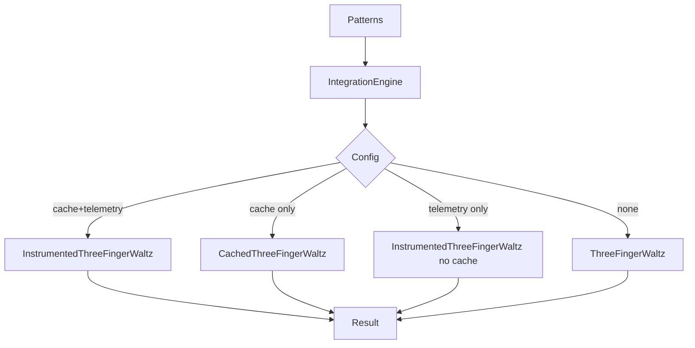
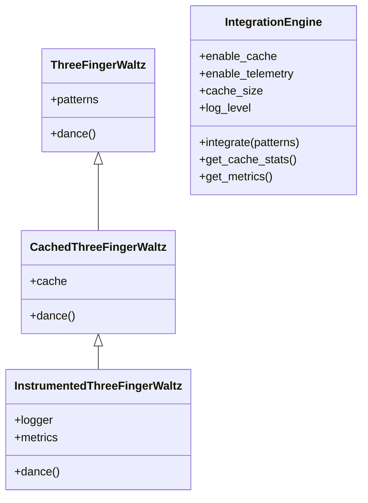
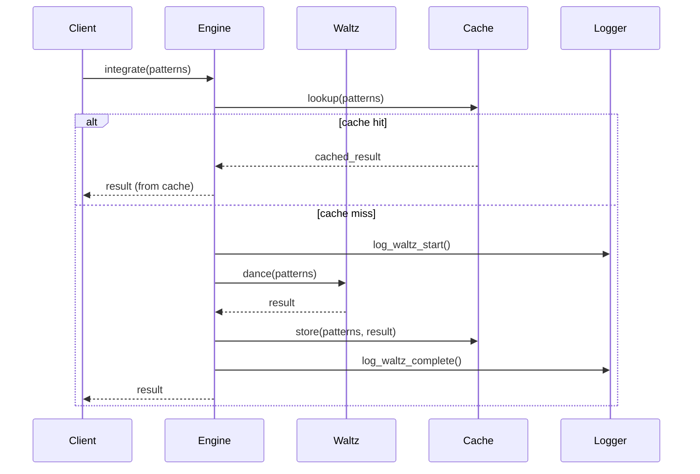

# 🔥 △ ⚡ Integration Engine v2.0.0

A production-ready, observable, cache-optimized framework for pattern integration, built on the Three-Finger Waltz core.

---

## 1. Architectural overview

### 1.1 Before (v1.x): basic integration

```python
# Simple, single-purpose waltz execution
waltz = ThreeFingerWaltz(patterns=patterns)
result = waltz.dance()
# ✓ Works, but no observability, no optimization
```

### 1.2 After (v2.0.0): production-ready integration

```python
import logging

engine = IntegrationEngine(
    enable_cache=True,        # Performance layer
    enable_telemetry=True,    # Observability layer
    cache_size=128,
    log_level=logging.INFO,
)

result = engine.integrate(patterns)
# ✓ Cached results
# ✓ Structured logs
# ✓ Performance metrics
# ✓ Multiple visualization formats
```

### 1.3 Core design patterns

- **Decorator pattern** (instrumentation and caching)
- **Strategy pattern** (implementation selection based on flags)
- **Observer pattern** (telemetry, metrics, logging)

---

## 2. API reference

### 2.1 `IntegrationEngine`

```python
class IntegrationEngine:
    def __init__(
        self,
        enable_cache: bool = True,
        enable_telemetry: bool = True,
        cache_size: int = 128,
        log_level: int = logging.INFO,
    ): ...
    
    def integrate(self, patterns) -> "IntegrationResult": ...
    def get_cache_stats(self) -> dict: ...
    def get_metrics(self) -> dict: ...
```

**Key behaviors:**

- **`integrate(patterns)`**  
  Executes the appropriate waltz implementation (basic, cached, instrumented) based on configuration.
- **`get_cache_stats()`**  
  Returns cache hit/miss statistics and hit rate.
- **`get_metrics()`**  
  Returns aggregate execution metrics (total executions, avg duration, error rate, etc.).

---

### 2.2 Waltz classes

```python
class ThreeFingerWaltz:
    def __init__(self, patterns): ...
    def dance(self): ...

class CachedThreeFingerWaltz(ThreeFingerWaltz):
    """Adds LRU caching to Three-Finger Waltz."""
    ...

class InstrumentedThreeFingerWaltz(CachedThreeFingerWaltz):
    """
    Fully instrumented Three-Finger Waltz.
    Combines caching with comprehensive logging and metrics collection
    for production monitoring and observability.
    """
    ...
```

---

## 3. Migration guide (v1.x → v2.0.0)

### 3.1 Direct replacement

**Before:**

```python
waltz = ThreeFingerWaltz(patterns=patterns)
result = waltz.dance()
```

**After (minimal change):**

```python
engine = IntegrationEngine(enable_cache=False, enable_telemetry=False)
result = engine.integrate(patterns)
```

### 3.2 Gradual adoption

```python
# Step 1: add caching only
waltz = CachedThreeFingerWaltz(patterns=patterns)
result = waltz.dance()

# Step 2: full instrumentation
waltz = InstrumentedThreeFingerWaltz(patterns=patterns)
result = waltz.dance()

# Step 3: move to IntegrationEngine
engine = IntegrationEngine(enable_cache=True, enable_telemetry=True)
result = engine.integrate(patterns)
```

---

## 4. Performance benchmarking guide

### 4.1 Basic benchmark pattern

```python
import time

engine = IntegrationEngine(enable_cache=True, enable_telemetry=True)

start = time.perf_counter()
result1 = engine.integrate(patterns)   # cold cache
t1 = time.perf_counter() - start

start = time.perf_counter()
result2 = engine.integrate(patterns)   # warm cache
t2 = time.perf_counter() - start

print("Cold:", t1, "seconds")
print("Warm:", t2, "seconds")
print("Speedup:", t1 / t2 if t2 > 0 else float("inf"))
print("Cache stats:", engine.get_cache_stats())
print("Metrics:", engine.get_metrics())
```

### 4.2 Recommended scenarios

- Small vs large pattern sets  
- Repeated integrations with overlapping patterns  
- Telemetry on vs off  
- Different cache sizes (e.g. 64, 128, 512)

---

## 5. Troubleshooting guide

### 5.1 Common issues

**Issue:** No performance improvement  
**Check:**

- Is `enable_cache=True`?
- Are you reusing the same `engine` instance?
- Are the patterns hashable / cache-key compatible?

---

**Issue:** No logs or metrics visible  
**Check:**

- Is `enable_telemetry=True`?
- Is `log_level` set appropriately (e.g. `logging.INFO`)?
- Is your logger configured to output to console/file?

---

**Issue:** High error rate in metrics  
**Check:**

- Validate pattern structure and constraints.
- Use visualization exports to inspect the waltz flow.
- Run the test suite (`test_cache.py`, `test_meta_operators.py`, etc.).

---

## 6. Diagrams (Mermaid)

### 6.1 Architecture flowchart



### 6.2 Class hierarchy



### 6.3 Sequence: cached vs uncached



---

## 7. Example usage

See:

- `code/integration/examples/before_after_migration.py`
- `code/integration/examples/common_patterns.py`
- `code/integration/examples/production_deployment.py`

for complete, runnable examples.

---

## See Also

- [Integration Work](./integration/integration_work.md) — Codex unification patterns
- [Phoenix Operators](../Phoenix/operators/) — Core transformation operators
- [Hydrogenesi Operators](../Hydrogenesi/operators/) — Structural preservation operators

---

**Documented by 🌊 Hydrogenesi • Ignited by 🔥 Phoenix**
