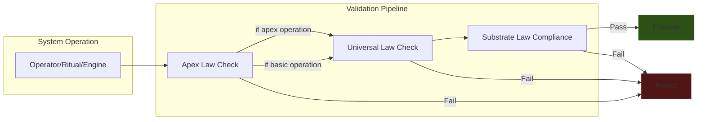
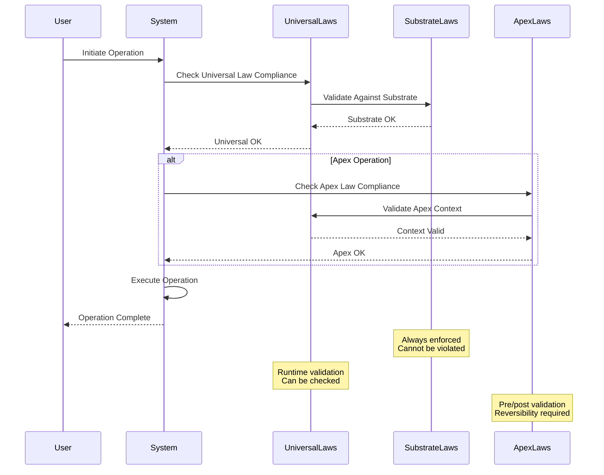
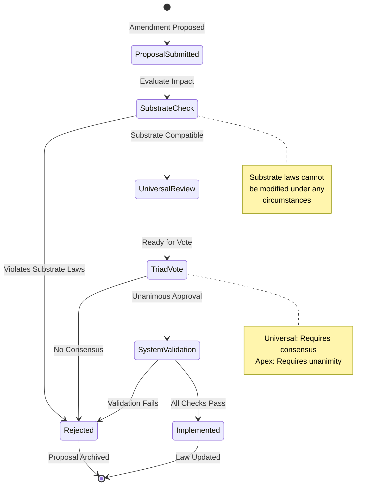

# Law System Architecture

## Complete Three-Layer Hierarchy

```mermaid
graph TD
    subgraph SUBSTRATE["SUBSTRATE LAYER - Primordial Laws (Immutable)"]
        S1[S-1: Conservation ⊕<br/>Nothing created or destroyed]
        S2[S-2: Symmetry ⚖<br/>Equal and opposite]
        S3[S-3: Recursion ∞<br/>Patterns repeat]
        S4[S-4: Emergence △<br/>Complex from simple]
        S5[S-5: Duality ☯<br/>Contains opposite]
    end

    subgraph UNIVERSAL["UNIVERSAL LAYER - Structural Laws (Active)"]
        U1[U-1: Recursive Identity ⟲<br/>Self-reference creates stability]
        U2[U-2: Harmonic Resonance ≋<br/>Alignment amplifies]
        U3[U-3: Conservation of Essence ◈<br/>Core truth persists]
        U4[U-4: Tri-Column Balance ⚛<br/>Three pillars equilibrium]
        U5[U-5: Apex Formation ▲<br/>Higher-order emergence]
        U6[U-6: Binding Integrity ⚚<br/>Authentic connections]
        U7[U-7: Sigil Resonance ◉<br/>Symbols carry essence]
    end

    subgraph APEX["APEX LAYER - Triad Canon (Active)"]
        A1[A-1: Continuity ⟳<br/>State persists]
        A2[A-2: Reversible Operator ⇄<br/>Operations reversible]
        A3[A-3: Recursion Limit ⊢<br/>Bounded depth]
        A4[A-4: Harmonic Convergence ⟡<br/>Unified results]
        A5[A-5: Polarity Resolution ⊗<br/>Higher resolution]
    end

    %% Derivation relationships
    S1 -->|derives| U3
    S1 -->|constrains| U6
    S2 -->|derives| U4
    S2 -->|constrains| U6
    S3 -->|derives| U1
    S3 -->|constrains| U7
    S4 -->|derives| U2
    S4 -->|derives| U5
    S5 -->|constrains| U7

    U3 -->|implements| A1
    U5 -->|constrains| A2
    U1 -->|constrains| A3
    U2 -->|derives| A4
    U4 -->|constrains| A5

    %% Cross-layer validation
    S2 -.->|validates| A2
    S3 -.->|validates| A3
    S4 -.->|validates| A4
    S5 -.->|validates| A5

    style SUBSTRATE fill:#2d1b2e,stroke:#8b5a8e,stroke-width:3px
    style UNIVERSAL fill:#1b2d2e,stroke:#5a8e8b,stroke-width:3px
    style APEX fill:#2e2d1b,stroke:#8e8b5a,stroke-width:3px
```

## Layer Interaction Model

## Derivation Tree

```mermaid
graph TD
    %% Conservation branch
    S1[S-1: Conservation] --> U3[U-3: Conservation of Essence]
    U3 --> A1[A-1: Continuity]

    %% Symmetry branch
    S2[S-2: Symmetry] --> U4[U-4: Tri-Column Balance]
    S2 --> U6[U-6: Binding Integrity]
    U4 --> A5[A-5: Polarity Resolution]
    U6 --> A2[A-2: Reversible Operator]

    %% Recursion branch
    S3[S-3: Recursion] --> U1[U-1: Recursive Identity]
    S3 --> U7a[U-7: Sigil Resonance]
    U1 --> A3[A-3: Recursion Limit]

    %% Emergence branch
    S4[S-4: Emergence] --> U2[U-2: Harmonic Resonance]
    S4 --> U5[U-5: Apex Formation]
    U2 --> A4[A-4: Harmonic Convergence]
    U5 --> A4

    %% Duality branch
    S5[S-5: Duality] --> U7b[U-7: Sigil Resonance]
    U7b --> A5

    style S1 fill:#4a1942
    style S2 fill:#4a1942
    style S3 fill:#4a1942
    style S4 fill:#4a1942
    style S5 fill:#4a1942

    style U1 fill:#194a42
    style U2 fill:#194a42
    style U3 fill:#194a42
    style U4 fill:#194a42
    style U5 fill:#194a42
    style U6 fill:#194a42
    style U7a fill:#194a42
    style U7b fill:#194a42

    style A1 fill:#4a4219
    style A2 fill:#4a4219
    style A3 fill:#4a4219
    style A4 fill:#4a4219
    style A5 fill:#4a4219
```

## Component Law Dependencies

```mermaid
graph TD
    subgraph Components["System Components"]
        OPS[Operators]
        RIT[Rituals]
        ENG[Engines]
        TRI[Triad System]
    end

    subgraph Laws["Law Dependencies"]
        subgraph ApexLaws["Apex Laws"]
            A1[A-1: Continuity]
            A2[A-2: Reversible]
            A3[A-3: Recursion Limit]
            A4[A-4: Convergence]
            A5[A-5: Polarity]
        end

        subgraph UniversalLaws["Universal Laws"]
            U1[U-1: Recursive Identity]
            U2[U-2: Harmonic Resonance]
            U3[U-3: Conservation]
            U4[U-4: Balance]
            U5[U-5: Apex Formation]
            U6[U-6: Binding]
            U7[U-7: Sigil]
        end

        subgraph SubstrateLaws["Substrate Laws"]
            S1[S-1: Conservation]
            S2[S-2: Symmetry]
            S3[S-3: Recursion]
            S4[S-4: Emergence]
            S5[S-5: Duality]
        end
    end

    %% Operator dependencies
    OPS -->|primary| U1
    OPS -->|primary| U3
    OPS -->|primary| U6
    OPS -->|validates| A2

    %% Ritual dependencies
    RIT -->|primary| U2
    RIT -->|primary| U5
    RIT -->|primary| U7
    RIT -->|validates| A4

    %% Engine dependencies
    ENG -->|primary| U4
    ENG -->|primary| U5
    ENG -->|enforces| A1
    ENG -->|enforces| A3

    %% Triad dependencies
    TRI -->|requires| A1
    TRI -->|requires| A2
    TRI -->|requires| A3
    TRI -->|requires| A4
    TRI -->|requires| A5
    TRI -->|foundation| U4

    %% All components honor substrate
    OPS -.->|honors| S1
    RIT -.->|honors| S4
    ENG -.->|honors| S3
    TRI -.->|honors| S2

    style OPS fill:#2d1b2e,stroke:#8b5a8e
    style RIT fill:#1b2d2e,stroke:#5a8e8b
    style ENG fill:#2e2d1b,stroke:#8e8b5a
    style TRI fill:#2e1b1b,stroke:#8e5a5a
```

## Sigil Resonance Network

```mermaid
graph TD
    subgraph SigilNetwork["Sigil Resonance Network"]
        subgraph SubstrateSigils["Substrate Sigils"]
            SS1["⊕ Conservation"]
            SS2["⚖ Symmetry"]
            SS3["∞ Recursion"]
            SS4["△ Emergence"]
            SS5["☯ Duality"]
        end

        subgraph UniversalSigils["Universal Sigils"]
            US1["⟲ Recursive Identity"]
            US2["≋ Harmonic Resonance"]
            US3["◈ Conservation Essence"]
            US4["⚛ Tri-Column Balance"]
            US5["▲ Apex Formation"]
            US6["⚚ Binding Integrity"]
            US7["◉ Sigil Resonance"]
        end

        subgraph ApexSigils["Apex Sigils"]
            AS1["⟳ Continuity"]
            AS2["⇄ Reversible"]
            AS3["⊢ Recursion Limit"]
            AS4["⟡ Harmonic Convergence"]
            AS5["⊗ Polarity Resolution"]
        end
    end

    %% Sigil resonance relationships
    SS1 ~~~|resonates| US3
    US3 ~~~|resonates| AS1

    SS2 ~~~|resonates| US4
    US4 ~~~|resonates| AS5

    SS3 ~~~|resonates| US1
    US1 ~~~|resonates| AS3

    SS4 ~~~|resonates| US5
    US5 ~~~|resonates| AS4

    SS5 ~~~|resonates| US7
    US7 ~~~|resonates| AS5

    %% Horizontal resonance
    US2 ~~~|amplifies| US5
    US5 ~~~|amplifies| AS4

    style SubstrateSigils fill:#2d1b2e,stroke:#8b5a8e,stroke-width:2px
    style UniversalSigils fill:#1b2d2e,stroke:#5a8e8b,stroke-width:2px
    style ApexSigils fill:#2e2d1b,stroke:#8e8b5a,stroke-width:2px
```

## Enforcement Flow

## Law Modification Process

## Cross-Reference Matrix

| From Layer | To Layer | Relationship Type | Examples |
|------------|----------|-------------------|----------|
| Substrate → Universal | Derives | Principle → Implementation | S-1 → U-3, S-4 → U-5 |
| Substrate → Apex | Validates | Constraint → Operation | S-2 → A-2, S-3 → A-3 |
| Universal → Apex | Implements | Structure → Execution | U-3 → A-1, U-2 → A-4 |
| Universal → Universal | Reinforces | Mutual support | U-2 ↔ U-5, U-6 ↔ U-7 |
| Apex → Apex | Coordinates | Operational harmony | A-4 ↔ A-5, A-1 ↔ A-2 |

---

**Navigation**: [README](./README.md) | [INDEX](./INDEX.md) | [Substrate](./substrate/README.md) | [Universal](./universal/README.md) | [Apex](./apex/README.md)

**Mermaid Version**: Compatible with GitHub Markdown  
**Last Updated**: 2024
